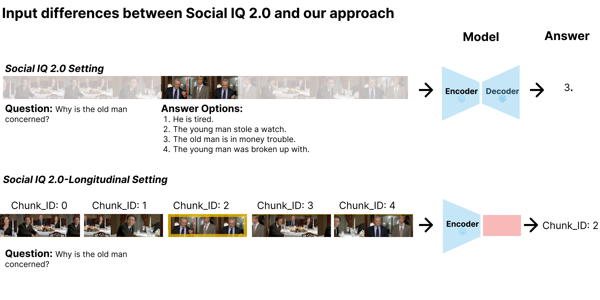
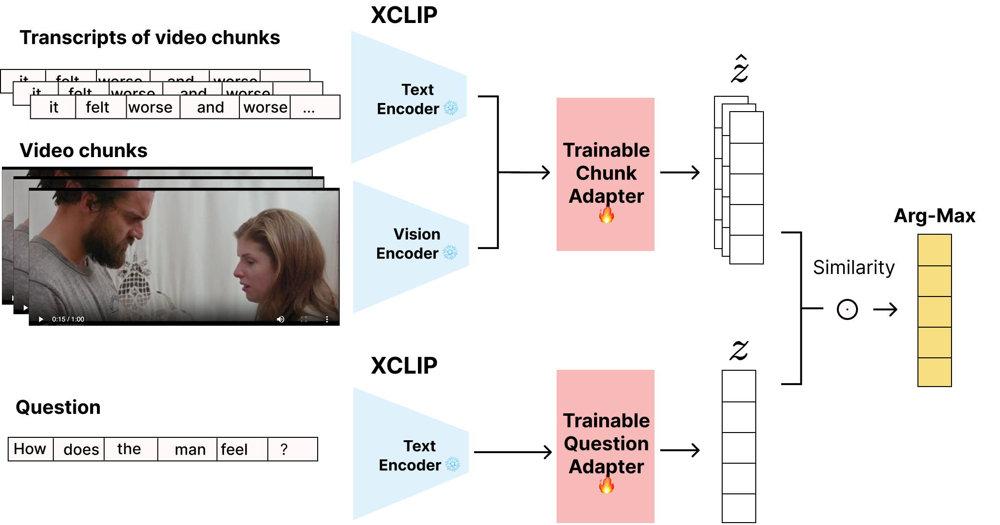

<div align="center">

# SIQ2-Long: Finding Relevance in Long-Horizon Social Reasoning

**Question-centric retrieval over long multimodal interactions, built on Social-IQ 2.0**

</div>

---

## Overview

Frontier multimodal models are strong social reasoners *when handed the right context*, but that context is usually given to them. Real social understanding rarely works that way: the evidence that answers a question may sit anywhere in a long, multi-party interaction, and the model has to find it first.

This project studies that gap. We show that (1) given the correct short clip, frontier models answer Social-IQ 2.0 questions well, but (2) their accuracy degrades steadily as the input grows, with several models unable to ingest 10-minute videos at all. This motivates a different framing: parse long-horizon interactions as a sequence of short-horizon spans and **retrieve the relevant one**. We formalize this as **multimodal oracle finding**, instantiate it as **SIQ2-Long** (an augmentative transformation of Social-IQ 2.0), and show that a lightweight adapter trained with **question-centric contrastive learning** on a frozen X-CLIP backbone improves oracle-retrieval accuracy by roughly **10 points** over the best zero-shot encoder.

---

## Motivation: reasoning is solved, retrieval is not

We first evaluate frontier models on Social-IQ 2.0 in their native input setting — no architectural changes — across increasing clip lengths. Two findings drive the rest of the project:

- **Given the right context, the reasoning is largely there.** On the original 1-minute clips, the strongest configuration (Gemini 2.5 Pro, video + audio) reaches **81.76%**, well above the unimodal baselines (77.84% audio, 74.14% video, 73.81% text).
- **Performance degrades with context length.** As clips grow to 5 and 10 minutes, every model drops, and several refuse the longer inputs outright.

<div align="center">

*Table 1. Zero-shot social reasoning accuracy across increasing video lengths, without architectural augmentation. Models are evaluated in their native input setting. "—" indicates the evaluation was not conducted; "\*" marks models limited to video inputs of up to 5 minutes.*

| Provider | Model | Modalities | 1 min (orig.) | 1–5 min | 5–10 min |
|----------|-------|:----------:|:-------------:|:-------:|:--------:|
| Google | Gemini 2.5 Pro | video + audio | **81.76** | **78.62** | **77.65** |
| Google | Gemini 2.5 Pro | video | 74.14 | 70.13 | 68.83 |
| Google | Gemini 2.5 Flash | video | 74.11 | 61.21 | 58.55 |
| NVIDIA | Xiaomi MiMo V2.5 | video | 57.09 | 53.60 | 49.10 |
| Google | Gemma 4 31B | video | 66.83 | 63.65 | \* |
| Qwen | Qwen3-VL 32B | video | 62.80 | 59.36 | \* |
| Google | Gemini 2.5 Pro | audio | 77.84 | — | — |
| Google | Gemini 2.5 Flash | text | 73.81 | — | — |
| OpenAI | GPT-4o Preview | audio | 70.86 | — | — |
| Meta | Llama 3.3 70B | text | 69.65 | — | — |
| OpenAI | GPT-4.1 Nano | text | 58.31 | — | — |
| NVIDIA | Nemotron Nano 12B 2 VL | video | 51.53 | — | — |

</div>

The takeaway: the bottleneck for long-horizon social reasoning is not the reasoning step but **locating the relevant span** in a long input.

---

## SIQ2-Long: oracle finding

SIQ2-Long reframes Social-IQ 2.0 as a retrieval task. Each question in Social-IQ 2.0 ships with a curated 1-minute clip that contains the answer; we treat that clip as the ground-truth label — the **oracle**. Instead of handing the model only the oracle, we give it the **full source video chunked into 1-minute spans**, encode every chunk, and ask the model to identify which chunk the question refers to. Concretely, the model scores each chunk against the question and selects the most similar one via arg-max.

<div align="center">



*Figure 1. In the original Social-IQ 2.0 setting (top), a model receives the oracle clip plus the question and answer options and predicts an answer. In the SIQ2-Long setting (bottom), the model receives all chunks of the full video and must retrieve the chunk (here, Chunk 2) that the question concerns.*

</div>

This isolates a single question: **is the representation of each chunk separable enough that a retrospective social-reasoning question can pick out the relevant one?** Under zero-shot encoders the answer was largely *no* — most models scored near chance on oracle retrieval, indicating that off-the-shelf representations are descriptive but not aligned to interrogative queries.

---

## Question-centric representation learning

To close that gap, we fine-tune a small trainable **adapter** on top of a **frozen X-CLIP** backbone. The chunk tower fuses the frozen video and transcript embeddings; the question tower encodes the Social-IQ question. Both are trained with an **InfoNCE** objective that pulls each question toward its oracle chunk and pushes it away from the other chunks of the same video — encouraging an **inquisitive** representation aligned to *what is being asked*, rather than a generic descriptive summary of the chunk.

<div align="center">



*Figure 2. Architecture. Frozen X-CLIP text and vision encoders embed the transcript and video chunks; a trainable chunk adapter fuses them into a chunk representation ẑ. A separate trainable question adapter encodes the question into z. Chunks are scored against the question by similarity, and the oracle is selected by arg-max.*

</div>

We experiment with three adapter variants that differ in how the two modalities are combined:

- **Mean-fusion** — averages the pooled video and transcript embeddings, then applies an MLP head. Simplest; preserves the encoder's native dimensionality.
- **Early-fusion** — concatenates the pooled video and transcript embeddings before the MLP head.
- **Late-interaction** — a ColBERT-style multi-vector adapter: a small Q-Former produces *K* tokens per chunk, and scoring uses token-level MaxSim, letting different tokens specialize to different social cues (affect, speech, scene).

Only the adapters and a learned temperature are trained; the X-CLIP backbone stays frozen, keeping the trainable footprint small.

---

## Results

Even short fine-tuning with question-centric contrastive learning substantially improves oracle retrieval over zero-shot encoders, with the fine-tuned X-CLIP variants clustering well above all zero-shot baselines.

<div align="center">


*Figure 3. Accuracy@1 on oracle retrieval per modality. The fine-tuned X-CLIP adapters (xclip-ft-li, -ef, -mean) outperform zero-shot encoder baselines across modalities.*

</div>

<div align="center">

*Table 2. Accuracy@1 on oracle retrieval. Best result per column in **bold**; "—" denotes a modality combination not evaluated for that model. Fine-tuned adapters use a frozen X-CLIP backbone.*

| Model | Text | Video | Fused |
|-------|:----:|:-----:|:-----:|
| *Zero-shot baselines* | | | |
| CLIP-ViT-B32-ft-MELD | 0.160 | 0.138 | — |
| All-mpnet-base-v2 | 0.204 | — | — |
| xclip-base-16-frames | 0.142 | 0.147 | — |
| dlip-vit-base-patch32 | 0.086 | 0.138 | — |
| dlip-vit-large-patch14 | 0.142 | 0.113 | — |
| siglip-base-patch16-224 | 0.094 | 0.114 | — |
| videointern2 | 0.073 | 0.158 | — |
| *Fine-tuned (ours)* | | | |
| xclip-ft-li | 0.211 | 0.231 | 0.231 |
| xclip-ft-ef | 0.160 | **0.250** | 0.179 |
| xclip-ft-mean | **0.221** | 0.183 | **0.260** |

</div>

The best fused configuration (`xclip-ft-mean`) reaches **0.260** accuracy@1, roughly a 10-point improvement over the strongest zero-shot encoder — achieved with a frozen backbone and a lightweight trainable adapter. This supports the central hypothesis: the limitation of off-the-shelf encoders is a **misalignment between descriptive representations and interrogative retrieval queries**, and question-centric contrastive learning is a first step toward bridging it.

---

## Repository structure

The evaluation harness is built around a small pipeline abstraction so new modalities and baselines plug in through a single registry.

| Piece | Role |
|-------|------|
| `Pipeline` (`pipelines/base.py`) | Shared lifecycle: config, logging, model runner, output paths |
| `PIPELINE_REGISTRY` (`pipelines/registry.py`) | Maps CLI `--pipeline` values to implementations |
| `LanguagePipeline` (`pipelines/lang_baseline.py`) | Transcript-only inputs; zero-shot MCQ on text |
| `VideoPipeline` (`pipelines/video_baseline.py`) | Native video inputs; zero-shot MCQ with visual context |

Pipelines support a composable `self.transforms` list — ordered `Callable[[dict], dict]` functions applied to every input row before inference (e.g. `video_clipped`, which clips each video to a window around the oracle segment). Transform parameters are set per experiment in YAML under `transform_configs`.

---

## Quick start

Requires **Python 3.12–3.13** (see `pyproject.toml`). Configure API keys in `.env`, then run a pipeline:

```bash
python scripts/run_pipeline.py --pipeline language --model "google_genai:gemini-2.5-flash" --split val
python scripts/run_pipeline.py --pipeline video --model "your_provider:your-video-model" --split val
python scripts/run_pipeline.py --pipeline oracle-find --model "your_provider:your-video-model" --split val
```

Use `--help` for concurrency, split options, and other flags.

---

## Roadmap

- **Harder negatives.** Mine negatives with high similarity to the oracle, rather than relying only on other chunks of the same video.
- **Cross-video easy negatives.** Add chunks sampled from unrelated videos to sharpen the contrastive signal.
- **End-to-end evaluation.** Couple the retriever with a downstream reasoner to measure answer accuracy on retrieved (rather than oracle) context.
